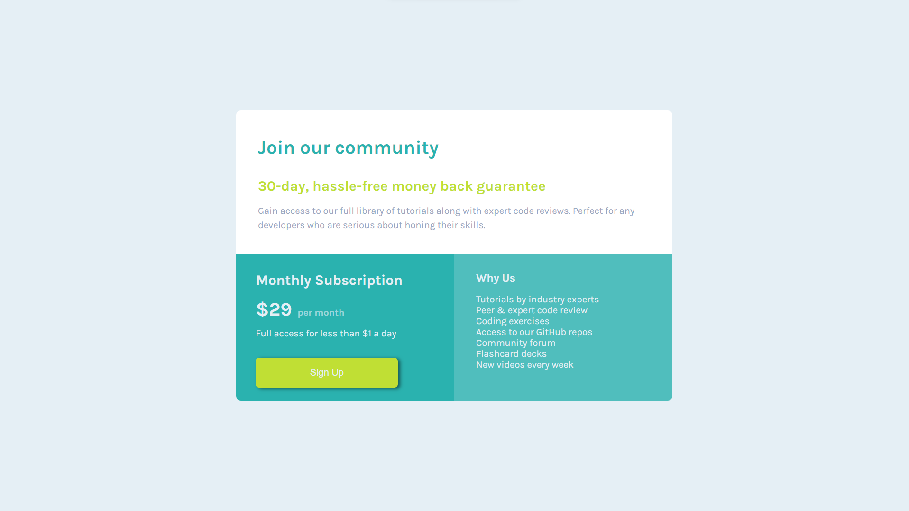

# Single-Price-Grid-Component

# Frontend Mentor - Single price grid component solution

This is a solution to the [Single price grid component challenge on Frontend Mentor](https://www.frontendmentor.io/challenges/single-price-grid-component-5ce41129d0ff452fec5abbbc). Frontend Mentor challenges help you improve your coding skills by building realistic projects. 

## Table of contents

- [Overview](#overview)
  - [The challenge](#the-challenge)
  - [Screenshot](#screenshot)
  - [Links](#links)
- [My process](#my-process)
  - [Built with](#built-with)
  - [What I learned](#what-i-learned)
  - [Continued development](#continued-development)
  - [Useful resources](#useful-resources)
- [Author](#author)
- [Acknowledgments](#acknowledgments)

## Overview

### The challenge

Users should be able to:

- View the optimal layout for the component depending on their device's screen size
- See a hover state on desktop for the Sign Up call-to-action

### Screenshot




### Links

- Solution URL: [Add solution URL here](https://your-solution-url.com)
- Live Site URL: [Add live site URL here](https://your-live-site-url.com)

## My process

### Built with

- Semantic HTML5 markup
- CSS custom properties
- CSS Grid

### What I learned

```css
/* Mobile Design */
@media (max-width: 786px) {
  .price-card-item {
    /* display: flex;
    flex-direction: column; */
    grid-template-columns: (4, 1fr);
    grid-template-rows: repeat(3, 1fr);
    padding: 3rem 0;
    width: 20rem;
  }

  /* PRICE CARD DESCRIPTION SECTION */
  .price-card-description {
    grid-column: 1 / 5;
    padding: 2% 4%;
  }

  .big-heading {
    font-size: 1.5rem;
  }

  .sub-heading {
    margin: 1rem 0;
    font-size: 1rem;
  }

  .card-description {
    font-size: 0.9rem;
  }

  .m-fw-400 {
    font-size: 400;
  }

  /* SUBSCRIPTION SECRION */
  .subscription {
    grid-column: 1 / 5;   
    border-bottom-left-radius: 0;
  }

  .subs-heading {
    font-size: 1.3rem;
  }

  .signup-btn {
    width: 16rem;
  }

  /* ABOUT US SECTION */
  .about-us {
    grid-column: 1 / 5;
    border-bottom-left-radius: 8px;
  }
}

```

### Continued development

1) Grid Layout
2) Responsive Design

### Useful resources

- [Net Ninja => Grid](https://www.youtube.com/playlist?list=PL4cUxeGkcC9itC4TxYMzFCfveyutyPOCY)

## Author

- Website - [Add your name here](https://www.your-site.com)
- Frontend Mentor - [@AmanGupta1703](https://www.frontendmentor.io/profile/AmanGupta1703)
